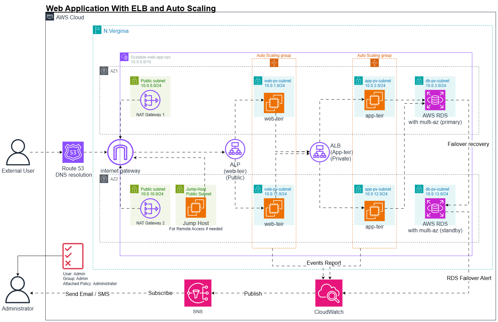

# AWS Architecture: Scalable Web Application
## Content:
- [High-level overview of the project](#high-level-overview-of-the-project)
- [Key AWS Services Used](#key-aws-services-used)
- [Some Notes](#some-notes)
- [IAM Roles](#some-notes)
- [Security Groups](#security-groups)
- [Project Flow](#project-flow)
- [Video: Project Implementation](#video-project-implementation)

## High-level overview of the project:

## Key AWS Services Used:
This is an architecture for a scalable web application on AWS using the following services:

* **EC2:** Launch instances for the web app.  
* **Application Load Balancer (ALB):** Distributes traffic across multiple instances.  
* **Auto Scaling Group (ASG):** Ensures instances scale based on demand.  
* **Amazon RDS (Optional):** Backend database (MySQL/PostgreSQL) with Multi-AZ.  
* **IAM:** Role-based access to instances.  
* **CloudWatch & SNS:** Monitor performance and send alerts. 

## Some Notes

* AWS NAT Gateways are provided in case the EC2 instances need to be updated or batched  
* Jump-Host EC2 instance is acting like a bastion host in case the admin needed to access any private instance for any reason.

## IAM Roles:

1. ALB: `AWSElasticLoadBalancingServiceRolePolicy`
2. ASG: `AWSServiceRoleForAutoScaling`
3. CloudWatch: `CloudWatchReadOnlyAccess`
## Security Groups:

|              | Inbound traffic                      | Outbound traffic                       |
| :----        | :----                                | :----                                  |
| ALB web tier | 0.0.0.0/0  :80 , 443                 | IP range of web EC2 subnets :80 ,443   |
| Web tier EC2 | IP of Web ALB : 80 , 443             | IP of App ALB:5000                     |
| ALB app tier | IP range of the web EC2 Subnets :5000| IP range of App EC2 subnets : 5000     |
| App tier EC2 | IP range of the web tier ALB:5000    | IP range of the RDS subnets : 3306     |
| RDS (MYSQL)  |IP range of the app tier subnets :3306| -                                      |

## Project Flow:

1. An external user types the DNS name of the website.  

2. AWS Route 53 resolves the DNS record and redirects the request to the ALB(Web Tier).  

3. The request passes through the VPC Internet Gateway to access the public ALB.  

4. The ALB redistributes the traffic to the EC2 instances under the ASG attached 
to the ALB on the web tier.  
   1. The ASG reacts to the load on the application:  
      1. If there is a high load, the ASG scales up the number of instances.  
      2. If the load drops down the ASG scales the instances down again.  
5. When the web tier has a request for the application tier, it sends the request to the ALB (App Tier) endpoint, which is private because it’s not meant to be accessed from the internet; only the web tier needs to access the app tier.  
   1. Then, the ALB does the same load balancing among the App Tier EC2 instances. And the same goes for the ASG.  

6. When the Application needs to query data from the database, it queries this data from RDS (primary).  
7. In case of the failure of the primary RDS instance, multi-AZ is enabled to recover with minimum downtime.  
8. CloudWatch monitors the application status for the following cases:  
   1. Events on the ASG ( Launch, Terminate, Fail to launch, Fail to terminate).  
   2. RDS failover and switching to the standby DB.  
9. CloudWatch publishes a message to the SNS topic.  
10.  The Admin is subscribed to the SNS topic, and he receives an email about the events.
